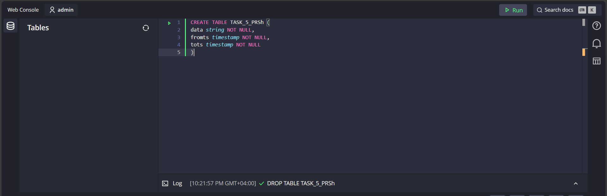
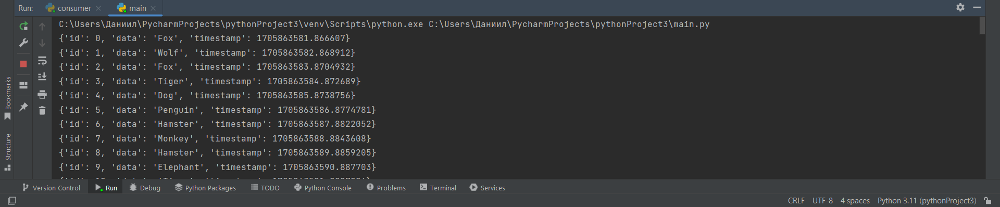

<h1>Задание номер 5</h1>
<b>Задание:</b>b> 
Реализовать систему сбора статистики входящего контента из кафки с использованием базы данных QuestDB.
В базе должна содержаться информация о том, какое значения какого поля сколько раз встретилось в течение заданного промежутка времени.
<h2>Установка утилит</h2>

Для начала был подгружен docker-образ quest.db на локальную машину

    docker run -p 9000:9000 -p 9009:9009 -p 8812:8812 -p 9003:9003 questdb/questdb:7.3.9

После запуска контейнера на http://localhost:9000 был представлен
граф. интерфейс для работы с БД,
с помощью которого создаем таблицу для сохраняемых данных

Далее скачиваем скрипт Apache Kafka  с официального сайта
и выполняем пошаговый запуск, представленные на сайте, предварительно поправив некоторые config файлы

_(В данной работе запуск производился в среде windows)_

<h2>Написание скрипта</h2>
После запуска questdb и kafka создаем свой скрипт эмуляции обмена сообщения,
где _main.py_ выполняет роль отслеживаемого скрипта с неким внутренним функционалом, для которого необходим контроль событий

И файл _consumer.py_ для обработки и сохранения событий.

В файле _main.py_  создан функционал случайной генерации названий животных, срабатываемое каждую секунду
При помощи библиотеки kafka-python создаем событие генерации.

В скрипте  _consumer.py_ происходит прием и сохранение ивентов из _main.py_
за указанный интервал времени.

По истичению указанного интервала, срабатывает скрипт, сохраняющий в базу данных объект, с перечислением количества значений
встретившихся за интервал и два timestamp с указанием интервала времени от и времени до

Далее полученные данные сохраняем в базу при помощи get-запроса.

Таким образом была настроена схема контроля событий.
